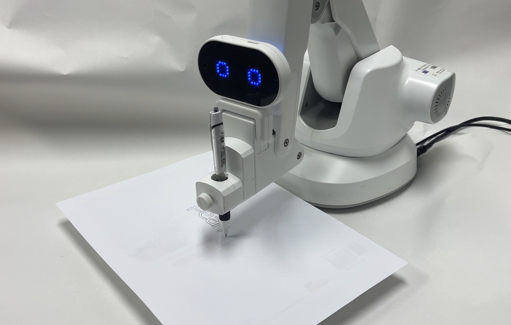
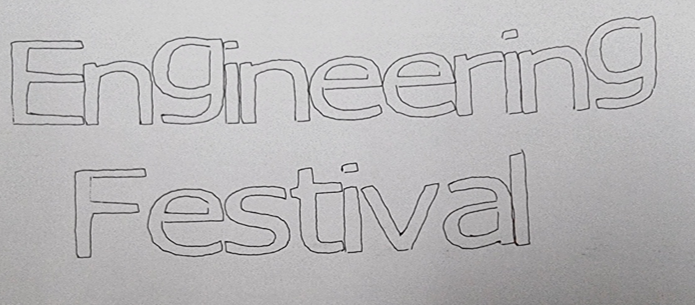
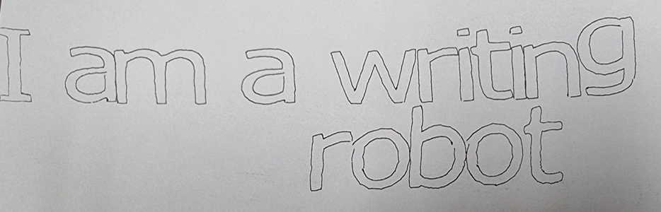

# 🤖 Talking Pen: Voice-to-Text Robot Arm

<div align="center">
  
  <p>
    
    
    
    
  </p>
</div>

---

## 📝 Project Overview
**Talking Pen** is an educational robot arm system designed to help children learn letters in an easy and engaging way. When children speak a word or sentence into a microphone, the robot recognizes the voice, converts it into text, and directly writes it on paper using its robotic arm. 
This process, where spoken words materialize into written text right before their eyes, motivates learning. It is designed to allow children to practice fine motor skills by tracing the written text, enabling simultaneous handwriting practice and physical development. The system can be widely utilized across various language learning environments.

## 🛠 Requirements
* [Python 3.x](https://www.python.org/downloads/)
* `PyAudio`, `SpeechRecognition` libraries
* Google Web Speech API & Google Translation integration
* [Inkscape](https://inkscape.org/) (for G-code extraction)
* HUENIT Robot Arm (Supernova)

## 🚀 Key Features
- **Voice Recognition & Auto-Translation**: Utilizes PyAudio and Google Web Speech API to extract Korean speech into text, and uses Google Translation to automatically translate it into English. The English text is then segmented by alphabet characters to generate G-code sequences.
- **Real-Time Text-to-Speech (TTS)**: While the robot is writing the translated English text, it repeatedly outputs a voice saying "(Korean) is (English)" to support children in learning the accurate pronunciation of English words.
- **G-code Optimized Writing**: Uses Inkscape to extract 72pt sized text outline G-code (`.ngc`), and optimizes the drawing trajectory for the robot arm by eliminating unnecessary CNC machining retract motions.
- **Precise Trajectory Controller**: Implements custom linear (`moveG0`) and curve (`moveG1`) movement functions. Includes coordinate validation via `checkXYZ` and fine velocity/acceleration control (`sendcommand`) for stable handwriting.

---

## 🛠 System Architecture

### Output Showcase
<div align="center">
  
  
</div>

| Category             | Component                 | Specification                                             |
| :------------------- | :------------------------ | :-------------------------------------------------------- |
| **Main Hardware**    | **HUENIT Robot Arm**      | Multi-joint small robot arm for educational and maker use |
| **Input Device**     | **Microphone**            | User voice input (e.g., connected to a laptop)            |
| **Speech-to-Text**   | **Google Web Speech API** | Korean voice recognition module                           |
| **Translation**      | **Google Translation**    | Auto KOR-ENG translation module                           |
| **G-code Generator** | **Inkscape**              | Converts English text to G-code coordinates               |

---

## 💻 Control Logic

### 1. Voice Processing Pipeline
Automation process from user utterance to G-code mapping:
- **Process**: Microphone Input → Voice Recognition (Korean) → English Translation → Alphabet Segmentation → Load matching `.ngc` files

### 2. Robot Arm Motion Control
To ensure smooth and precise handwriting, Supernova's proprietary trajectory control logic was applied.
- **Linear Control (`moveG0`)**: Receives G01 G-code command coordinates for linear movement.
- **Curve Control (`moveG1`)**: Responds to G02/G03 G-code commands to implement smooth curve writing.
- **Error Calibration & Collaboration**: Resolved pen holder clearance and circular distortion issues through technical cooperation with the manufacturer (Supernova). Achieved high writing completion by adjusting motor speed and reflecting the distance offset between the robot arm center and pen into the code (`M1007`, etc.).

---

## 🎞 Demonstration

### Robot Arm Writing Action
<div align="center">
  
</div>

---

## 📂 Project Structure
```text
.
├── final code/         # Python source code integrating voice recognition, translation, and robot control
├── gcode/              # Collection of G-code (.ngc) extracted per alphabet and word
└── README.md
```

## 🏆 Awards
- 🥈 **2024 캡스톤디자인 경진대회** - 은상(2nd Place)
- 🏅 **2024 지능형 로봇 컨소시엄 창의적 종합설계 경진대회** - 장려상(Encouragement Award)
- 🏅 **2024 산업체 연계 캡스톤 디자인 ECHO+ 경진대회** - 장려상(Encouragement Award)

---
